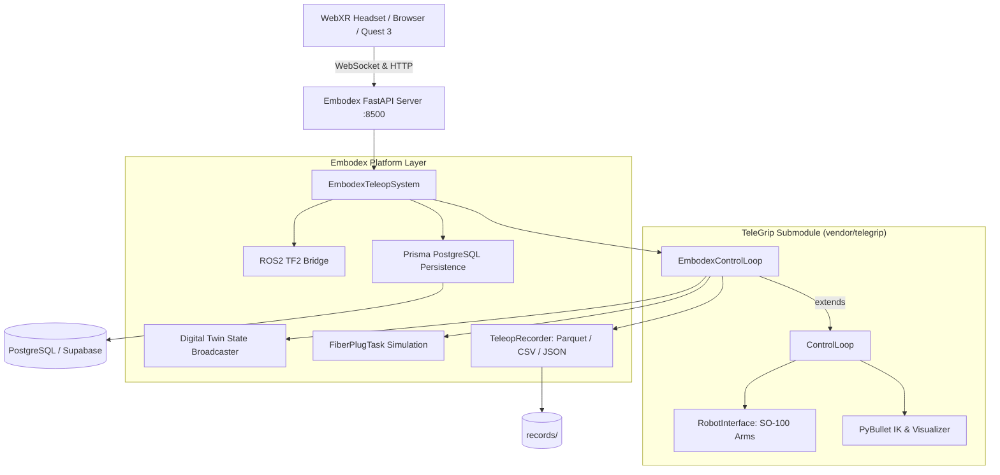

# Embodex Teleop 🤖🥽

[](LICENSE)
[](https://www.python.org/)
[](https://github.com/Luis-Lundgren/telegrip)
[](https://github.com/Luis-Lundgren/embodex-web)

**Embodex Teleop** is an open-source teleoperation and embodied data collection engine for robotic manipulators. It provides WebXR virtual-reality control, digital-twin simulation, dataset recording (Parquet, CSV, JSON), challenge tasks, and REST/WebSocket APIs.

The system is designed with a clean separation of concerns:
- **TeleGrip Core (`vendor/telegrip`)**: Owns kinematics, PyBullet IK solver, serial motor interfaces, and VR input parsing.
- **Embodex Platform (`embodex`)**: Owns dataset recording, episode sessions, challenge tasks, database persistence, REST endpoints, ROS2 transform bridges, and the Motion Exchange ecosystem.

---

## 🏛️ Architecture



---

## ✨ Features

- **Zero-Hardware Simulation**: Start learning and developing immediately without physical robot hardware. The digital twin runs headless or via PyBullet GUI.
- **WebXR Teleoperation**: Real-time 6DoF teleoperation directly inside any WebXR-compatible browser (Meta Quest 2/3/Pro, Apple Vision Pro, desktop keyboard).
- **Embodied Dataset Recording**: Capture rich multi-modal episodes:
  - VR controller poses (position, orientation, grip, trigger)
  - Joint positions & velocities (6-DoF follower arms)
  - End-effector Cartesian trajectories
  - Task state & object latch states
  - Exported to **Parquet**, **CSV**, and **Motion Exchange JSON** formats.
- **Challenge Tasks**: Physics-based simulated tasks (such as precision fiber optic connector plugging) with automatic grasp latching and success metrics.
- **Lightweight by Default**: ML frameworks (PyTorch, LeRobot) are strictly optional, keeping installation fast and base Docker images small.
- **ROS2 Ready**: Optional ROS2 node broadcasting robot poses and transforms.

---

## 🚀 Quick Start

### 1. Clone the Repository (with Submodules)

```bash
git clone --recurse-submodules https://github.com/Luis-Lundgren/embodex-teleop.git
cd embodex-teleop
```

> **Note:** If cloned without `--recurse-submodules`, initialize them with:
> ```bash
> git submodule update --init --recursive
> ```

### 2. Set Up Python Environment

Python 3.10+ is supported:

```bash
python3 -m venv .venv
source .venv/bin/activate
pip install -r requirements-base.txt
pip install -e ./vendor/telegrip
pip install -e .
```

### 3. Run in Simulation Mode (No Robot Required)

```bash
embodex-teleop --no-robot --digital-twin
```

Open your browser to:
- **WebXR Teleop Interface:** [http://localhost:8500](http://localhost:8500)
- **Health Check:** [http://localhost:8500/health](http://localhost:8500/health)
- **System Status API:** [http://localhost:8500/api/status](http://localhost:8500/api/status)

---

## 🦾 Hardware Setup (SO-100 Robot Arms)

When operating with physical SO-100 arms powered by Feetech STS3215 bus servos:

```bash
# Bimanual setup (left arm on /dev/ttyACM0, right arm on /dev/ttyACM1)
embodex-teleop --left-port /dev/ttyACM0 --right-port /dev/ttyACM1 --autoconnect

# Single arm setup (left only)
embodex-teleop --left-port /dev/ttyACM0
```

Grant serial port permissions if needed:
```bash
sudo usermod -aG dialout $USER
# (Log out and log back in for changes to take effect)
```

---

## 🐳 Docker Support

Run with Docker in simulation mode with persistent local recording:

```bash
# Build container
docker build -t embodex-teleop .

# Run container (ports 8500 exposed, mounting records directory)
docker run -p 8500:8500 -v $(pwd)/records:/app/records embodex-teleop
```

---

## 🧪 Testing

Run automated smoke tests in simulation mode:

```bash
pytest tests/
```

Or run the standalone smoke test:

```bash
python3 tests/test_smoke.py
```

---

## 📁 Repository Structure

```text
embodex-teleop/
├── .gitmodules                 # Submodule configuration for vendor/telegrip
├── vendor/
│   └── telegrip/               # Minimal fork of DipFlip/telegrip (MIT)
│       ├── telegrip/           # Core kinematics, IK solver, serial motors
│       └── URDF/               # SO-100 robot URDF and mesh models
├── embodex/                    # Embodex platform package (Apache-2.0)
│   ├── adapters/               # TeleGrip subclass & workspace extensions
│   ├── api/                    # FastAPI server & REST/WebSocket routes
│   ├── database/               # Prisma database persistence
│   ├── recording/              # Episode recording (Parquet, CSV, JSON)
│   ├── ros2/                   # ROS2 TF2 broadcaster bridge
│   ├── tasks/                  # Challenge task simulation (FiberPlug)
│   └── cli.py                  # CLI command entrypoints
├── tests/                      # Automated smoke test suite
├── web-ui/                     # Static WebXR teleoperation interface
├── Dockerfile                  # Production container definition
├── pyproject.toml              # Package definition (embodex-teleop)
├── requirements-base.txt       # Base simulation dependencies
├── requirements-ml.txt         # Optional ML dependencies (PyTorch, LeRobot)
└── THIRD_PARTY_NOTICES.md      # Attribution & licenses for upstream works
```

---

## 📜 License & Attribution

- **Embodex Teleop** is licensed under the [Apache License 2.0](LICENSE).
- **TeleGrip** (`vendor/telegrip`) is created by Emil Rofors and licensed under the [MIT License](https://github.com/DipFlip/telegrip).
- **SO-100 URDF & 3D Assets** are created by the [LeRobot](https://github.com/huggingface/lerobot) community and licensed under Apache-2.0.

See [THIRD_PARTY_NOTICES.md](THIRD_PARTY_NOTICES.md) for full license texts.
