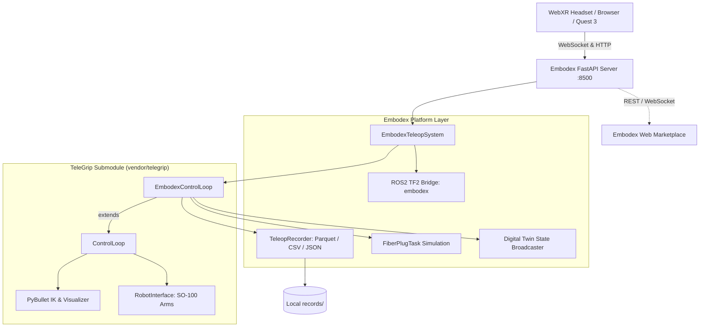

# Embodex Teleop 🤖🥽

[](LICENSE)
[](https://www.python.org/)
[](https://github.com/Luis-Lundgren/telegrip)
[](https://github.com/Luis-Lundgren/embodex-web)

**Embodex Teleop** is an open-source teleoperation and embodied data collection engine for robotic manipulators. It provides WebXR virtual-reality control, digital-twin simulation, dataset recording (Parquet, CSV, JSON), challenge tasks, and authenticated REST/WebSocket APIs.

---

## 🏛️ Public Architecture & System Boundaries

The Embodex robotics ecosystem is organized into three distinct architectural tiers:

```text
┌─────────────────────────────────────────────┐
│               Embodex Web                   │
│                                             │
│ Marketplace • Users • Labs • Jobs • Data    │
└───────────────────┬─────────────────────────┘
                    │
              HTTP / WebSocket
                    │
┌───────────────────▼─────────────────────────┐
│              Embodex Teleop                 │
│                                             │
│ Sessions • Recording • Simulation • Robot   │
└───────────────────┬─────────────────────────┘
                    │
              adapter layer
                    │
┌───────────────────▼─────────────────────────┐
│                  TeleGrip                   │
│                                             │
│ WebXR • IK • Kinematics • SO-100 Control    │
└─────────────────────────────────────────────┘
```

> **TeleGrip** provides the core robot teleoperation engine. **Embodex Teleop** builds a session, recording, API, and data layer around it. **Embodex Web** provides the marketplace and user-facing platform.

### Responsibility Split:
- **`embodex-web`** owns user identity, NextAuth sessions, lab profiles, marketplace datasets, job dispatching, and payments. It acts as the canonical database owner.
- **`embodex-teleop`** owns active teleoperation sessions, robot and simulation state, episode trajectory recordings (Parquet/CSV/JSON), hardware interfaces, and local APIs.
- **`telegrip`** (`vendor/telegrip`) owns low-level SO-100 Feetech bus servo control, PyBullet inverse kinematics, WebXR controller tracking, and core teleoperation motion logic.



---

## 🛡️ Security and Physical Robot Safety

Embodex Teleop is designed to be **safe by default when reachable over a network**. It features three operational security modes configured via `EMBODEX_SECURITY_MODE`:

* **`local`**: Permitted for rapid localhost experimentation and development. Allows unauthenticated local access. Must be considered development-only behavior.
* **`simulation`**: Zero-hardware simulation mode. Read-only endpoints (`GET /health`, `GET /api/status`, `GET /api/sessions`) remain public for monitoring; hardware-affecting commands are rejected or token-guarded if configured.
* **`hardware`**: Default mode when physical robot control is enabled (`--left-port` / physical hardware active). Hardware-affecting and private dataset routes strictly require Bearer token authentication matching `EMBODEX_API_TOKEN`.

### Protected Endpoints (Hardware Mode):
- `POST /api/config` (Robot and system configuration)
- `POST /api/keyboard` (Virtual keyboard control enable/disable)
- `POST /api/robot` (Connect / disconnect physical robot arms)
- `POST /api/keypress` (Simulated keystrokes affecting motor positions)
- `POST /api/task` (Task resets and simulation interactions)
- `POST /api/restart` (Backend runtime soft restart)
- `GET /api/sessions/{session_id}` (Raw trajectory dataset contents)
- `WS /ws` (WebXR controller stream and command WebSocket)

### Critical Safety Guidelines:
1. **Never expose an unauthenticated physical robot controller directly to the public internet** (e.g., via Cloudflare Tunnels, Fly.io, or port forwarding) without configuring `EMBODEX_SECURITY_MODE=hardware` and setting a cryptographically strong `EMBODEX_API_TOKEN`.
2. **Authenticate with Bearer tokens**: Pass `Authorization: Bearer <EMBODEX_API_TOKEN>` in HTTP headers. For WebXR browsers, authenticate using `Sec-WebSocket-Protocol: bearer.<token>` or `?token=<token>`.
3. **Restrict CORS Origins**: Set `EMBODEX_ALLOWED_ORIGINS` to a comma-separated allowlist of trusted domains (e.g., `EMBODEX_ALLOWED_ORIGINS=http://localhost:3000,https://www.embodex.online`).
4. **Test in simulation first**: Always test new controllers, gripper actions, and challenge tasks using `--no-robot` before powering physical Feetech STS3215 servos.
5. **Emergency stop procedures**: Always maintain a physical power cutoff or emergency stop switch within reach of any active SO-100 robot workspace.

---

## 🧩 Compatibility Matrix

Support claims are categorized as **Tested**, **Supported**, **Expected**, or **Experimental**:

| Component / Platform | Status | Notes |
| :--- | :--- | :--- |
| **SO-100 Robot Arm** | **Tested** | Primary physical 6-DoF arm with Feetech STS3215 servos |
| **Meta Quest 3 / 3S** | **Tested** | Primary validated WebXR headset with 6-DoF controllers |
| **Desktop Browser** | **Tested** | Chrome/Firefox/Edge via keyboard teleoperation and simulation |
| **Meta Quest 2** | **Expected** | WebXR-compatible browser runtime; not continuously regression-tested |
| **Meta Quest Pro** | **Expected** | WebXR-compatible runtime |
| **Apple Vision Pro** | **Experimental** | Safari WebXR support may vary across visionOS updates |
| **ROS2 Bridge** | **Experimental** | Optional TF2 / goal broadcaster bridge (`embodex_teleop_bridge`) |
| **Python 3.10** | **Tested** | Supported base runtime |
| **Python 3.11** | **Tested** | Primary development runtime |
| **Python 3.12** | **Supported** | Tested in automated CI validation |

---

## ✨ Features

- **Zero-Hardware Simulation**: Start learning immediately without physical hardware. The digital twin runs headless or via PyBullet GUI.
- **WebXR Teleoperation**: Real-time 6DoF teleoperation directly inside WebXR browsers.
- **Embodied Dataset Recording**: Capture multi-modal episodes:
  - VR controller poses (position, orientation, grip, trigger)
  - Joint positions & velocities (6-DoF follower arms)
  - End-effector Cartesian trajectories
  - Task state & object latch states
  - Exported to **Parquet**, **CSV**, and **Motion Exchange JSON** formats.
- **Challenge Tasks**: Physics-based simulated tasks (such as precision fiber optic connector plugging) with automatic grasp latching and success metrics.
- **Lightweight by Default**: Base dependencies are fast and minimal. Heavy ML frameworks (PyTorch, LeRobot) are strictly optional.
- **Clean CLI Namespace**: `embodex-teleop` and `telegrip` provide separate, collision-free command-line tools.

---

## 🚀 Quick Start

### 1. Clone the Repository (with Submodules)

```bash
git clone --recurse-submodules https://github.com/Luis-Lundgren/embodex-teleop.git
cd embodex-teleop
```

> **Note:** If cloned without `--recurse-submodules`, initialize them with:
> ```bash
> git submodule update --init --recursive
> ```

### 2. Set Up Python Environment

```bash
python3 -m venv .venv
source .venv/bin/activate
pip install -r requirements-base.txt
pip install -e ./vendor/telegrip
pip install -e .
```

Verify that both CLIs resolve to their respective tools:

```bash
# TeleGrip core CLI
telegrip --help

# Embodex Teleop CLI
embodex-teleop --help
```

### 3. Run in Simulation Mode (No Robot Required)

```bash
embodex-teleop --no-robot --digital-twin
```

Open your browser to:
- **WebXR Teleop Interface:** [http://localhost:8500](http://localhost:8500)
- **Health Check:** [http://localhost:8500/health](http://localhost:8500/health)
- **System Status API:** [http://localhost:8500/api/status](http://localhost:8500/api/status)

---

## 🦾 Hardware Setup (SO-100 Robot Arms)

When operating with physical SO-100 arms:

```bash
# Set secure hardware mode and authentication token
export EMBODEX_SECURITY_MODE=hardware
export EMBODEX_API_TOKEN="your-secure-token-here"

# Bimanual setup (left arm on /dev/ttyACM0, right arm on /dev/ttyACM1)
embodex-teleop --left-port /dev/ttyACM0 --right-port /dev/ttyACM1 --autoconnect

# Single arm setup (left only)
embodex-teleop --left-port /dev/ttyACM0
```

Grant serial port permissions if needed:
```bash
sudo usermod -aG dialout $USER
# (Log out and log back in for changes to take effect)
```

---

## 🐳 Docker Support

Run with Docker in simulation mode with persistent local recording:

```bash
# Build container
docker build -t embodex-teleop .

# Run container (ports 8500 exposed, mounting records directory)
docker run -p 8500:8500 -v $(pwd)/records:/app/records embodex-teleop
```

---

## 🧪 Testing

Run automated tests:

```bash
pytest tests/
```

Or run standalone smoke test:

```bash
python3 tests/test_smoke.py
```

---

## 📁 Repository Structure

```text
embodex-teleop/
├── .gitmodules                 # Submodule configuration for vendor/telegrip
├── vendor/
│   └── telegrip/               # Minimal fork of DipFlip/telegrip (MIT)
│       ├── telegrip/           # Core kinematics, IK solver, serial motors
│       └── URDF/               # SO-100 robot URDF and mesh models
├── embodex/                    # Embodex platform package (Apache-2.0)
│   ├── adapters/               # TeleGrip subclass & workspace extensions
│   ├── api/                    # Authenticated FastAPI server & WebSocket routes
│   │   ├── security.py         # Mode-based access control & Bearer token auth
│   │   └── server.py           # Unified REST and WebXR WebSocket server
│   ├── database/               # Session indexing & web notification hooks
│   ├── recording/              # Episode recording (Parquet, CSV, JSON)
│   ├── ros2/                   # ROS2 TF2 broadcaster bridge (embodex_teleop_bridge)
│   ├── tasks/                  # Challenge task simulation (FiberPlug)
│   └── cli.py                  # CLI command entrypoints
├── tests/                      # Automated smoke, CLI, and security test suite
├── web-ui/                     # Static WebXR teleoperation interface
├── Dockerfile                  # Production container definition
├── pyproject.toml              # Package definition (embodex-teleop)
├── requirements-base.txt       # Base simulation dependencies
├── requirements-ml.txt         # Optional ML dependencies (PyTorch, LeRobot)
└── THIRD_PARTY_NOTICES.md      # Attribution & licenses for upstream works
```

---

## 📜 License & Attribution

- **Embodex Teleop** is licensed under the [Apache License 2.0](LICENSE).
- **TeleGrip** (`vendor/telegrip`) is created by **Emil Rofors** and licensed under the [MIT License](https://github.com/DipFlip/telegrip).
- **SO-100 URDF & 3D Assets** are created by the [LeRobot](https://github.com/huggingface/lerobot) community and licensed under Apache-2.0.

See [THIRD_PARTY_NOTICES.md](THIRD_PARTY_NOTICES.md) for full license texts.
